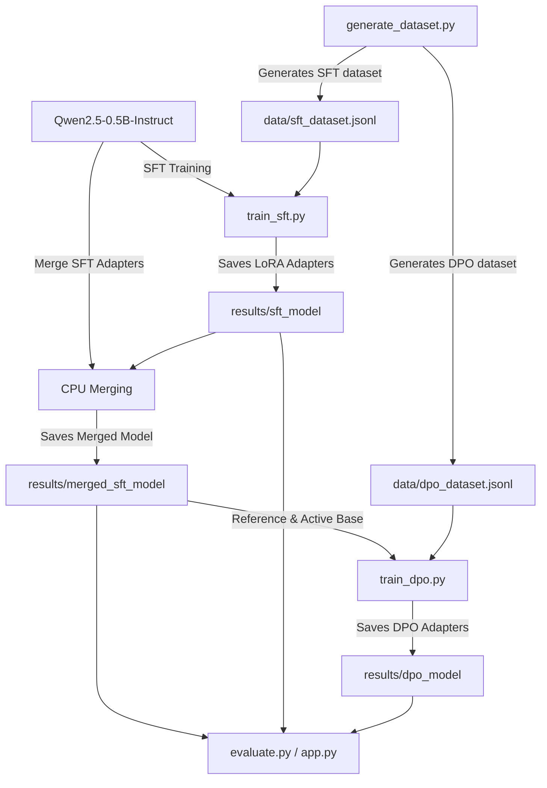

# 🛠️ LLM Tool-Calling Fine-Tuning (LoRA & DPO)

This project demonstrates a complete end-to-end pipeline to fine-tune a lightweight Large Language Model (**Qwen2.5-0.5B-Instruct**) for reliable, strictly formatted JSON tool-calling without conversational filler. It leverages **Supervised Fine-Tuning (SFT)** via QLoRA/LoRA and **Direct Preference Optimization (DPO)** to align outputs with exact JSON schemas.

---

## 📌 Architecture & Pipeline Workflow

Below is the workflow showing how synthetic data is generated, used to train LoRA adapters, merged with the base model, and aligned using preference optimization:



---

## 📂 Project Structure

```bash
├── README.md               # Project documentation (this file)
├── pyproject.toml          # Project metadata and UV dependencies
├── requirements.txt        # PIP dependencies
├── app.py                  # Streamlit visual comparative application
├── hello.py                # Setup test script
├── data/                   # Generated datasets (SFT & DPO)
│   ├── sft_dataset.jsonl
│   └── dpo_dataset.jsonl
├── results/                # Saved models and adapters (Git ignored)
│   ├── sft_model/          # SFT LoRA Adapters
│   ├── merged_sft_model/   # Merged SFT Model (Base for DPO)
│   └── dpo_model/          # DPO Aligned LoRA Adapters
└── src/
    ├── generate_dataset.py # Synthetic data generation script
    ├── train_sft.py        # Supervised Fine-Tuning training loop
    ├── train_dpo.py        # Direct Preference Optimization training loop
    └── evaluate.py         # Evaluation benchmark script
```

---

## ⚙️ Installation & Setup

This repository supports environment management using either `uv` (recommended) or `pip`.

### Option A: Using UV (Recommended)
If you have [uv](https://github.com/astral-sh/uv) installed:
```bash
# Sync and install all dependencies into a virtual environment
uv sync
```

### Option B: Using standard PIP
```bash
# Create a virtual environment
python3 -m venv .venv
source .venv/bin/activate

# Install dependencies
pip install -r requirements.txt
```

---

## 🚀 Step-by-Step Execution Guide

### Step 1: Generate the Datasets
To create the synthetic dataset (500 samples for SFT and 500 samples for DPO preference pairs):
```bash
# Using UV
uv run python src/generate_dataset.py

# Using Pip
python src/generate_dataset.py
```
* **SFT Dataset (`data/sft_dataset.jsonl`)**: Contains conversation messages (system, user, assistant) in standard ChatML format where the assistant output is strictly a JSON tool call string.
* **DPO Dataset (`data/dpo_dataset.jsonl`)**: Contains preference pairs with a `prompt`, `chosen` response (correct strict JSON tool call), and `rejected` response (either conversational text surrounding JSON, incorrect parameter naming, or invalid JSON syntax).

---

### Step 2: Supervised Fine-Tuning (SFT)
Train the LoRA adapters using QLoRA/LoRA on the generated SFT dataset.
```bash
# Using UV
uv run python src/train_sft.py

# Using Pip
python src/train_sft.py
```
* **Base Model**: `Qwen/Qwen2.5-0.5B-Instruct`
* **Adapter Config**: LoRA Rank = 16, Alpha = 32, targeting attention projection and MLP gate modules.
* **Hardware Adaptation**: Automatically checks for CUDA. If CUDA is present, it uses `bitsandbytes` 4-bit quantization and paged AdamW optimizer to conserve memory. If on macOS/CPU, it falls back to standard precision.
* **Output**: LoRA adapter weights saved in `results/sft_model/`.

---

### Step 3: Direct Preference Optimization (DPO)
Perform preference alignment so the model learns to choose strict JSON formats over chatty or invalid ones.
```bash
# Using UV
uv run python src/train_dpo.py

# Using Pip
python src/train_dpo.py
```
* **Pipeline Mechanism**:
  1. Loads the base model and `sft_model` adapters, and merges them on CPU (`results/merged_sft_model`).
  2. Reloads the merged model as the starting point for DPO.
  3. Uses `DPOTrainer` from TRL to compute DPO loss between `chosen` and `rejected` generations.
* **Output**: Aligned DPO LoRA adapters saved in `results/dpo_model/`.

---

### Step 4: Evaluate the Models
Run the benchmarking script to evaluate and compare the baseline model, SFT adapter, and DPO-aligned adapter against a strict JSON-parsing accuracy metric.
```bash
# Using UV
uv run python src/evaluate.py

# Using Pip
python src/evaluate.py
```
This tests each model on unseen prompts and checks:
1. Whether the output is valid JSON.
2. Whether the JSON calls the correct tool name (`get_weather` or `calculate`) and maps arguments properly.

---

### Step 5: Run the Streamlit Web Application
Run the Streamlit frontend to interact with the models in real-time, inspect their raw completions, and visually compare tool call formatting.
```bash
# Using UV
uv run streamlit run app.py

# Using Pip
streamlit run app.py
```

---

## 🛠️ Hyperparameter & Training Configuration

### SFT Configuration (`train_sft.py`)
* **Learning Rate**: `2e-4`
* **LoRA Target Modules**: `q_proj`, `k_proj`, `v_proj`, `o_proj`, `gate_proj`, `up_proj`, `down_proj`
* **Batch Size / Accumulation**: Batch Size of `4`, Gradient Accumulation of `4`
* **Scheduler**: Cosine with a warm-up ratio of `0.03`

### DPO Configuration (`train_dpo.py`)
* **Learning Rate**: `5e-5`
* **Beta (DPO temperature)**: `0.1`
* **Batch Size / Accumulation**: Batch Size of `1`, Gradient Accumulation of `1` (Optimized for quick CPU execution; originally Batch Size `2`, Accumulation `8`)
* **Max Steps**: `5` (Demo steps optimized for CPU validation; originally `50`)
* **Reference Model**: Implicitly handled by TRL PEFT adapter configurations.
* **DPO Trainer Config**: Uses `DPOConfig` with `max_length=512`, `max_prompt_length=128`, and `remove_unused_columns=False`.
